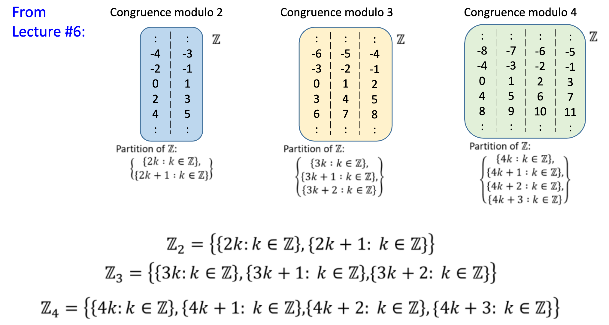

# Lecture 7 Functions
---
**Definitions**: Given any real number $x$,
(1) the **floor** of $x$, denoted $\lfloor x\rfloor$, is the unique integer $n$ such that $n \leq x<n+1$;
(2) the **ceiling** of $x$, denoted $[x]$, is the unique integer $n$ such that $n-1<x \leq n$.

### Function
>A function $f$ from a set $X$ to set $Y$, denoted $f:X \to Y$, is a relation satisfying the following properties:
>
>1. $\forall x \in X, \exists y \in Y$ such that $(x,y) \in f$
2. $\forall x \in X, \exists y_1,y_2 \in Y,((x,y_1) \in f \wedge(x,y_2)\in f) \to y_1=y_2$

A function from $X$ to $Y$ is an assignment to each element of $X$ exactly one element of $Y$

### Argument, image, preimage, input, output
>Let $f: X \rightarrow Y$ be a function. We write $f(x)=y$ iff $(x, y) \in f$.
>
We say that " $f$ sends/maps $x$ to $y^{\prime \prime}$ and we may also write $x \rightarrow y$ or $f: x \mapsto y$. Also, $x$ is called the **argument** of $f$
>
>$f(x)$ is read " $f$ of $x$ ", or "the **output** of $f$ for the **input** $x$ ", or "the value of $f$ at $x^{\prime \prime}$, or "the **image** of $x$ under $f^{\prime \prime}$.
>
>If $f(x)=y$, then $x$ is a **preimage** of $y$

### Setwise image and preimage
>Let $f: X \rightarrow Y$ be a function from set $X$ to set $Y$.
>- If $A \subseteq X$, then let $f(A)=\{f(x): x \in A\}$.
>- If $B \subseteq Y$, then let $f^{-1}(B)=\{x \in X: f(x) \in B\}$
>
>We call $f(A)$ the (**setwise**) **image** of $A$, and $f^{-1}(B)$ the (**setwise**) preimage of $B$ under $f$.

### Domain, co-domain, range
>Let $f: X \rightarrow Y$ be a function from set $X$ to set $Y$.
>- $X$ is the **domain** of $f$ and $Y$ the **co-domain** of $f$.
>- The **range** of $f$ is the (setwise) image of $X$ under $f$ : $\{y \in Y: y=f(x)$ for some $x \in X\}$

---

## Sequences and String
### Sequence
>A sequence $a_0, a_1, a_2, \cdots$ can be represented by a function $a$ whose domain is $\mathbb{Z}_{\geq 0}$ that satisfies $a(n)=a_n$ for every $n \in \mathbb{Z}_{\geq 0}$

### Fibonacci Sequence
>The Fibonacci sequence $F_0, F_1, F_2, \cdots$ is defined by setting, for each $n \in \mathbb{Z}_{\geq 0}, F_0=0$ and $F_1=1$ and $F_{n+2}=F_{n+1}+F_n$

### String
>Let $A$ be a set. A string or a word over $A$ is an expression of the forn $a_0 a_1 a_2 \cdots a_{l-1}$ where $l \in \mathbb{Z}_{\geq 0}$ and $a_0, a_1, a_2, \cdots, a_{l-1} \in A$. Here $l$ is called the length of the string. The empty string $\varepsilon$ is the string of length 0.
Let $A^*$ denote the set of all strings over $A$.

### Equality of Sequences
>Given two sequences $a_0, a_1, a_2, \cdots$ and $b_0, b_1, b_2, \cdots$ defined by the functions $a(n)=a_n$ and $b(n)=b_n$ respectively for every $n \in \mathbb{Z}_{\geq 0}$, we say that the two sequences are equal if and only if $a(n)=b(n)$ for every $n \in \mathbb{Z}_{\geq 0}$

### Equality of Strings
>Given two strings $s_1=a_0 a_1 a_2 \cdots a_{l-1}$ and $s_2=b_0 b_1 b_2 \cdots b_{l-1}$ where $l \in \mathbb{Z}_{\geq 0}$, we say that $s_1=s_2$ if and only if $a_i=b_i$ for all $i \in\{0,1,2, \ldots, l-1\}$

---

## Function Equality 
### <mark style="background: #FF5582A6;">Theorem 7.1.1 Function Equality</mark>
Two functions $f: A \rightarrow B$ and $g: C \rightarrow D$ are equal, i.e. $f=g$, iff (i) $A=C$ and $B=D$, and (ii) $f(x)=g(x) \forall x \in A$.

---
## Injection, Surjections, Bijections and Inverse Functions

### <mark style="background: #ADCCFFA6;">Injections (One-to-one Function)</mark>
>A function $f: X \rightarrow Y$ is injective (or one-to-one) iff
>$$
\forall x_1, x_2 \in X\left(f\left(x_1\right)=f\left(x_2\right) \Rightarrow x_1=x_2\right) \text {. }
>$$
or, equivalently (contrapositive), $x_1 \neq x_2 \Rightarrow f\left(x_1\right) \neq f\left(x_2\right)$.
An injective function is called an injection.

**Example:** Define a function $f: \mathbb{Q} \rightarrow \mathbb{Q}$ by setting $f(x)=3 x+1$ for all $x \in \mathbb{Q}$. Is $f$ injective?
1. Let $x_1, x_2 \in \mathbb{Q}$ such that $f\left(x_1\right)=f\left(x_2\right)$.
2. Then $3 x_1+1=3 x_2+1$.
3. So $x_1=x_2$.

### <mark style="background: #ADCCFFA6;">Surjection</mark>
>A function $f: X \rightarrow Y$ is surjective (or onto) iff
>$$
\forall y \in Y \exists x \in X(y=f(x)) \text {. }
>$$
Every element in the co-domain has a preimage. So, range $=$ co-domain. A surjective function is called a surjection.

**Example:** Define a function $f: \mathbb{Q} \rightarrow \mathbb{Q}$ by setting $f(x)=3 x+1$ for all $x \in \mathbb{Q}$. Is $f$ surjective?

1. Take any $y \in \mathbb{Q}$.
2. Let $x=(y-1) / 3$.
3. Then $x \in \mathbb{Q}$ and $f(x)=3 x+1=3\left(\frac{y-1}{3}\right)+1=y$.

### <mark style="background: #ADCCFFA6;">Bijection (One to one correspondence)</mark>

>A function $f: X \rightarrow Y$ is bijective iff $f$ is injective and surjective, i.e.
>$$
\forall y \in Y \exists ! x \in X(y=f(x)) \text {. }
>$$
A bijective function is called a bijection or one-to-one correspondence.

To prove bijective, show both injective and surjective.

---
## Inverse Functions
### Inverse function
>Let $f: X \rightarrow Y$. Then $g: Y \rightarrow X$ is an inverse of $$f$ iff $\forall x \in X \forall y \in Y(y=f(x) \Leftrightarrow x=g(y))$$
We denote the inverse of $f$ as $f^{-1}$.

### <mark style="background: #FF5582A6;">Proposition: Uniqueness of inverses</mark>
>If $g_1$ and $g_2$ are inverses of $f: X \rightarrow Y$, then $g_1=g_2$.

---
## Bijectivity and invertibility
### <mark style="background: #FF5582A6;">Theorem 7.2.3</mark>
>If $f: X \rightarrow Y$ is a bijection, then $f^{-1}: Y \rightarrow X$ is also a bijection. In other words, $f: X \rightarrow Y$ is bijective iff $f$ has an inverse.
>

---
## Composition of Functions
### Composition of functions
>Let $f: X \rightarrow Y$ and $g: Y \rightarrow Z$ be functions.
Define a new function $g \circ f: X \rightarrow Z$ as follows:
>$$
(g \circ f)(x)=g(f(x)) \forall x \in X .
>$$
where $g \circ f$ is read " $g$ circle $f^{\prime \prime}$ and $g(f(x))$ is read " $g$ of $f$ of $x$ ". The function $g \circ f$ is called the **composition** of $f$ and $g$.

### <mark style="background: #FF5582A6;">Theorem 7.3.1 Composition with an identity Function</mark>
>If $f$ is a function from a set $X$ to a set $Y$, and $i d_X$ is the identity function on $X$, and $i d_Y$ is the identity function on $Y$, then
>$$
\begin{aligned}
&f \circ i d_X=f \text { and } \\
&i d_Y \circ f=f
\end{aligned}
>$$

### <mark style="background: #FF5582A6;">Theorem 7.3.2 Composition of a Function with its inverse</mark>

>If $f: X \rightarrow Y$ is a bijection with inverse function $f^{-1}: Y \rightarrow X$, then
$$f^{-1} \circ f=i d_X \text{ and } f \circ f^{-1}=i d_Y$$

### <mark style="background: #FF5582A6;">Theorem: Associativity of Function Composition</mark>
>Let $f: A \rightarrow B, g: B \rightarrow C$ and $h: C \rightarrow D$. Then
>$$
(h \circ g) \circ f=h \circ(g \circ f) \text {. }
>$$
Function composition is associative.

Note that function composition is non commutative

### <mark style="background: #FF5582A6;">Theorem 7.3.3 Composition of Injections</mark>
If $f: X \rightarrow Y$ and $g: Y \rightarrow Z$ are both injective, then $g \circ f$ is injective.

### <mark style="background: #FF5582A6;">Theorem 7.3.3 Composition of Surjections</mark>
If $f: X \rightarrow Y$ and $g: Y \rightarrow Z$ are both surjective, then $g \circ f$ is surjective.

---
## Addition and Multiplication Functions on $\mathbb{Z_n}$

The quotient $\mathbb{Z} / \sim_n$ where $\sim_n$ is the congruence-mod- $n$ relation on $\mathbb{Z}$, is denoted $\mathbb{Z}_n$.

### Addition and Multiplication on $\mathbb{Z_n}$
>Define addition $+$ and multiplication $\cdot$ on $\mathbb{Z}_n$ as follows: whenever $[x],[y] \in \mathbb{Z}_n$,
>$$
[x]+[y]=[x+y] \quad \text { and } \quad[x] \cdot[y]=[x \cdot y]
>$$

### Proposition: Addition on $\mathbb{Z_n}$ is well defined
>For all $n \in \mathbb{Z}^{+}$and all $\left[x_1\right],\left[y_1\right],\left[x_2\right],\left[y_2\right] \in \mathbb{Z}_n$,
>$$
\left[x_1\right]=\left[x_2\right] \text { and }\left[y_1\right]=\left[y_2\right] \Rightarrow\left[x_1\right]+\left[y_1\right]=\left[x_2\right]+\left[y_2\right]
>$$
>

### Proposition: Multiplication on $\mathbb{Z_n}$ is well defined
>For all $n \in \mathbb{Z}^{+}$and all $\left[x_1\right],\left[y_1\right],\left[x_2\right],\left[y_2\right] \in \mathbb{Z}_n$,
>$$
\left[x_1\right]=\left[x_2\right] \text { and }\left[y_1\right]=\left[y_2\right] \Rightarrow\left[x_1\right] \cdot\left[y_1\right]=\left[x_2\right] \cdot\left[y_2\right] \text {. }
>$$
>

