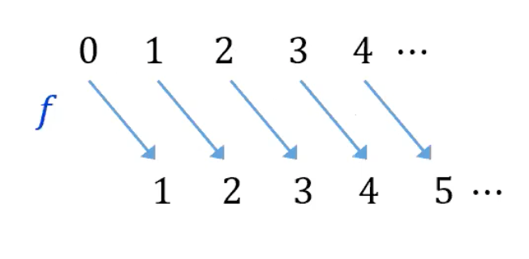

# Lecture 9 Cardinality 
---

## Pigeonhole Principle
### Pigeonhole Principle

>Let $A$ and $B$ be finite sets. If there is an injection $f:A \to B$, then $|A|\leq|B|$ .
>
>Contrapositive: Let $m,n\in\mathbb{Z^+}$ with $m>n$. If $m$ pigeons are put into $n$ pigeonholes, then there 
>must be (at least) one pigeonhole with (at least) two pigeons.
>

### Dual pigeonhole Principle

>Let A and B be finite sets. If there is a surjection $f:A→B$, then $|A|≥|B|$.
>
>Contrapositive: Let $m,n∈Z^+$ with $m<n$. If m pigeons are put into $n$ pigeonholes, then there must be (at least) one pigeonhole with no pigeons.
>

---

## Cardinality
### Finite set and infinite set

>Let $\mathbb{Z}_n=\{1,2,3, \ldots, n\}$, the set of positive integers from 1 to $n$. 
>A set $S$ is said to be **finite** iff $S$ is empty, or there exists a bijection from $S$ to $\mathbb{Z}_n$ for some $n \in \mathbb{Z}^{+}$.
>A set $S$ is said to be **infinite** if it is not finite.

### Theorem: Equality of Cardinality of Finite Sets

>Let $A$ and $B$ be any finite sets.
>$|A|=|B|$ iff there is a bijection $f: A \rightarrow B$
>

### Same Cardinality (Cantor)

>Given any two sets $A$ and $B . A$ is said to have the same cardinality as $B$, written as
>$|A|=|B|$, iff there is a bijection $f: A \rightarrow B$.

We define what $|A| = |B|$ means without defining what $|A|$ and $|B|$ means

**Example:** $\ |\mathbb{N}|=|\mathbb{N} \backslash\{0\}|$ because the function $f: \mathbb{N} \rightarrow$ $\mathbb{N} \backslash\{0\}$ satisfying $f(x)=x+1$ for all $x \in \mathbb{N}$ is a bijection.

**Example:**
$|2\mathbb{Z}| = |\mathbb{Z}|$
An infinite set can have the same cardinality as a proper subset of itself.
Let $2 \mathbb{Z}$ be the set of all even integers. Prove that $2 \mathbb{Z}$ and $\mathbb{Z}$ have the same cardinality.

Consider the function $H$ from $\mathbb{Z}$ to $2 \mathbb{Z}$ defined as follows:
$$
H(n)=2 n, \forall n \in \mathbb{Z}
$$

1. To show that $H$ is injective:
$1.1$ Suppose $H\left(n_1\right)=H\left(n_2\right)$ for some integers $n_1, n_2$.
$1.2$ Then $2 n_1=2 n_2$ (by the definition of $H$ ), and hence $n_1=n_2$.
$1.3$ Therefore $H$ is injective.
2. To show that $H$ is surjective:
$2.1$ Suppose $m \in 2 \mathbb{Z}$.
2.2 Then $m$ is an even integer, so $m=2 k$ for some integer $k$ (by the definition of even integer)
$2.3$ But $H(k)=2 k=m$.
$2.4$ Thus $\exists k \in \mathbb{Z}$ s.t. $H(k)=m$.
$2.5$ Therefore $H$ is surjective.
3. Therefore $H$ is a bijection, and so $2 \mathbb{Z}$ and $\mathbb{Z}$ have the same cardinality (by Cantor's definition of cardinality).

### Theorem 7.3.1 Properties of Cardinality

>The cardinality relation is an equivalence relation.
For all sets $A, B$ and $C$ :
a. Reflexive: $|A|=|A|$.
b. Symmetric: $|A|=|B| \rightarrow|B|=|A|$.
c. Transitive: $(|A|=|B|) \wedge(|B|=|C|) \rightarrow|A|=|C|$.

---
## Countably infinite

### Countable Sets

The set $\mathbb{Z}^{+}$of counting numbers $\{1,2,3, \ldots\}$ is in a sense, the most basic of all infinite sets.

>The set $A$ having the same cardinality as $\mathbb{Z}^{+}$ is called countably infinite.

The reason is that the bijection between the two sets can be used to "count" the elements of $A$ :

If $F$ is the bijection from $\mathbb{Z}^{+}$to $A$, then "$F(1)$" can be designated as the first element of $A,$ "$F(2)$"  as the second element of $A$, and so forth.

>Note: We may use $\mathbb{N}$ or $\mathbb{Z}_{\geq 0}$ instead of $\mathbb{Z}^{+}$in the definition.

### Cardinal numbers

>Define $\aleph_0=\left|\mathbb{Z}^{+}\right|$. (Some author use $\mathbb{N}$ instead of $\mathbb{Z}^{+}$.)
$\aleph$ is pronounced "aleph", the first letter of the Hebrew alphabet. This is the first cardinal number.

### Countably infinite

>A set $S$ is said to be countably infinite (or, $S$ has the cardinality of natural numbers) iff $|S|=\aleph_0$.

### Countable set and Uncountable set

>A set is said to be **countable** iff it is finite or countably infinite.
>A set is said to be **uncountable** if it is not countable

### Theorem

>$\mathbb{Z}^{+} \times \mathbb{Z}^{+} \text {is countable}$, $\mathbb{Q}^{+} \text {is countable }$,$\mathbb{Z}$ is countable

### Theorem (Cartesian Product)

>If sets $A$ and $B$ are both countably infinite, then so is $A \times B$.

### Corollary (General Cartesian Product)

>Given $n \geq 2$ countably infinite sets $A_1, A_2, \cdots, A_n$, the Cartesian product $A_1 \times A_2 \times \cdots \times A_n$ is also countably infinite.

### Theorem (Unions)

>The union of countably many countable sets is countable. That is, if $A_1, A_2, \cdots$ are all countable sets, then so is $\bigcup_{i=1}^{\infty} A_i \quad$

---
## Countability via Sequences

### Proposition $9.1$

>An infinite set $B$ is countable if and only if there is a sequence $b_0, b_1, b_2, \cdots \in B$ in which every element of $B$ appears exactly once.

### Lemma 9.2: Countability via Sequence

>An infinite set $B$ is countable if and only if there is a sequence $b_0, b_1, b_2, \cdots$ in which every element of $B$ appears.

---

## Larger Infinities

### Theorem 7.4.2 (Cantor)

>The set of real numbers between 0 and 1 ,
>$$
(0,1)=\{x \in \mathbb{R} \mid 0<x<1\}
>$$
>is uncountable.

### Theorem 7.4.3

>Any subset of any countable set is countable.

### Theorem 7.4.3

>Any subset of any countable set is countable.

### Corollary 7.4.4 (Contrapositive of Theorem 7.4.3)

>Any set with an uncountable subset is uncountable.

### Proposition $9.3$

>Every infinite set has a countably infinite subset.

### Lemma 9.4: Union of Countably Infinite Sets.

>Let $A$ and $B$ be countably infinite sets. Then $A \cup B$ is countable.

