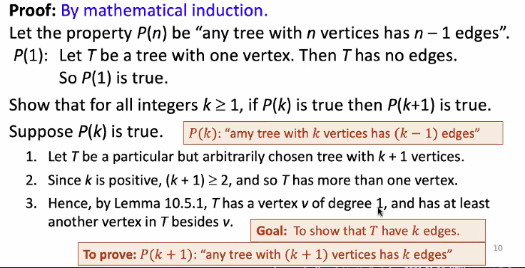
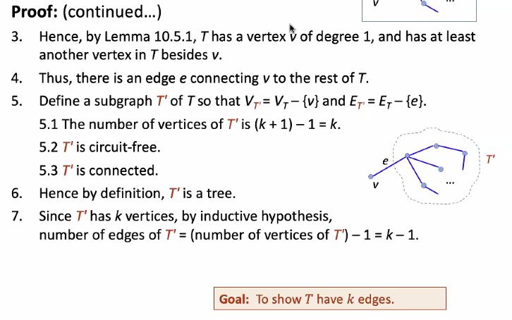

# Proofs
---

## Pigeonhole Principle

1. Note that A is finite. Suppose $A={a_1,a_2,⋯,a_m}$ where $m=|A|$.

2. The injectivity of f tells us that, if $a_i≠a_j$, then $f(a_i)≠f(a_j)$.

3. So $f(a_1),f(a_2),⋯,f(a_m)$ are $m$ different elements of $B$.

4. This shows $|B|≥m=|A|$.

## Dual Pigeonhole Principle

1. Note that $B$ is finite. Suppose $B={b_1,b_2,⋯,b_n}$ where $n=|B|$.

2. For each $b_i$, use the surjectivity of $f$ to find $a_i∈A$ such that $f(a_i)=b_i$.

3. If $b_i≠b_j$, then $f(a_i)≠f(a_j$) and so $a_i≠a_j$ as $f$ is a function.

4. So $a_1,a_2,⋯,a_n$ are $n$ different elements of $A$.

5. This shows $|A|≥n=|B|$.

## Equality of Cardinality of Finite Sets
1. $(\Leftarrow)$ This follows from the two Pigeonhole Principles.
2. $(\Rightarrow)$ If $A=\left\{a_1, a_2, \cdots, a_n\right\}$ and $B=\left\{b_1, b_2, \cdots, b_n\right\}$, then the function $f: A \rightarrow B$ satisfying $f\left(a_i\right)=b_i$ for $i \in\{1,2, \cdots, n\}$ is a bijection.

## Properties of Cardinality
Proof (**reflexivity**): To prove $|A|=|A|$.
It suffices to show that $i d_A$ is a bijection $A \rightarrow A$.
1. $i d_A$ is injective because if $x_1, x_2 \in A$ such that $i d_A\left(x_1\right)=$ $i d_A\left(x_2\right)$, then $x_1=x_2$.
2. $i d_A$ is surjective because given any $x \in A$, we have $i d_A(x)=x$.

Proof (**symmetry**): To prove $|A|=|B| \rightarrow|B|=|A|$.
1. Suppose $|A|=|B|$.
2. Use Cantor's definition of same-cardinality to find a bijection $f: A \rightarrow B$.
3. By , $f^{-1}: B \rightarrow A$ is also a bijection.
4. Therefore, $|B|=|A|$.

Proof (**transitivity**): To prove $(|A|=|B|) \wedge(|B|=|C|) \rightarrow|A|=|C|$.
1. Suppose $|A|=|B|$ and $|B|=|C|$.
2. Use Cantor's definition of same-cardinality to find a bijection $f: A \rightarrow B$ and a bijection $g: B \rightarrow C$.
3. From Tutorial $6 \mathrm{Q} 1,(g \circ f)^{-1}=f^{-1} \circ g^{-1}$.
4. In particular, this means $g \circ f$ has an inverse.
5. So by  , $g \circ f$ is a bijection $A \rightarrow C$.
6. Therefore, $|A|=|C|$.

## Uniqueness of inverses
1. Note that $g_1, g_2: Y \rightarrow X$.
2. Since $g_1$ and $g_2$ are inverses of $f$, for all $x \in X$ and $y \in Y, x=g_1(y) \Leftrightarrow y=f(x) \Leftrightarrow x=g_2(y)$.
3. Therefore $g_1=g_2$.

## Theorem 7.2.3
Proof: ( $f: X \rightarrow Y$ is bijective iff $f$ has an inverse)
1. ("if") Suppose $f$ has an inverse, say $g: Y \rightarrow X$.
1.1. We show injectivity of $f$.
1.1.1. Let $x_1, x_2 \in X$ such that $f\left(x_1\right)=f\left(x_2\right)$.
1.1.2. Define $y=f\left(x_1\right)=f\left(x_2\right)$.
1.1.3. Then $x_1=g(y)$ and $x_2=g(y)$ as $g$ is an inverse of $f$.
1.1.4. Hence $x_1=x_2$.
1.2. We show surjectivity of $f$.
1.2.1. Let $y \in Y$.
1.2.2. Define $x=g(y)$.
1.2.3. Then $y=f(x)$ as $g$ is an inverse of $f$.
1.3. Therefore $f$ is bijective.
2. ("only if") Suppose $f$ is bijective.
2.1. Then $\forall y \in Y \exists ! x \in X(y=f(x))$ by the definition of bijection.
2.2. Define the function $g: Y \rightarrow X$ by setting $g(y)$ to be the unique $x \in X$ such that $y=f(x)$ for all $y \in Y$.
2.3. This $g$ is well defined and is an inverse of $f$ by the definition of inverse functions.
3. Therefore $f: X \rightarrow Y$ is bijective iff $f$ has an inverse.

## Theorem: Associativity of Function Composition
1. The domains of $(h \circ g) \circ f$ and $h \circ(g \circ f)$ are both $A$.
2. The codomains of $(h \circ g) \circ f$ and $h \circ(g \circ f)$ are both $D$.
3. For every $x \in A$,
$$
((h \circ g) \circ f)(x)=(h \circ g)(f(x))=h(g(f(x)))=h((g \circ f)(x))=(h \circ(g \circ f))(x) \text {. }
$$

## Theorem 7.3.3 Composition of Injections
Proof:
1. Suppose $f: X \rightarrow Y$ and $g: Y \rightarrow Z$ are injections and let $x_1, x_2 \in X$ such that $(g \circ f)\left(x_1\right)=(g \circ f)\left(x_2\right)$.
2. Then $\left(g\left(f\left(x_1\right)\right)=g\left(f\left(x_2\right)\right)\right.$ by the definition of function composition.
3. Since $g$ is injective, so $f\left(x_1\right)=f\left(x_2\right)$ by the definition of injection.
4. Since $f$ is injective, so $x_1=x_2$ by the definition of injection.
5. Therefore $g \circ f$ is injective.

## Theorem 7.3.3 Composition of Surjections
Proof:
1. Suppose $f: X \rightarrow Y$ and $g: Y \rightarrow Z$ are surjections and let $z \in Z$.
2. Since $g$ is surjective, so there is an element $y \in Y$ such that $g(y)=z$ by the definition of surjection.
3. Since $f$ is surjective, so there is an element $x \in X$ such that $f(x)=y$ by the definition of surjection.
4. Hence there exists an element $x \in X$ such that $(g \circ f)(x)=g(f(x))=g(y)=z$.
5. Therefore $g \circ f$ is surjective.

## Proposition: Addition on $\mathbb{Z_n}$ is well defined
Proof:
1. Let $\left[x_1\right],\left[y_1\right],\left[x_2\right],\left[y_2\right] \in \mathbb{Z}_n$ such that $\left[x_1\right]=\left[x_2\right]$ and $\left[y_1\right]=\left[y_2\right]$.
2. Then $x_1 \equiv x_2(\bmod n)$ and $y_1 \equiv y_2(\bmod n)$ by the definition of congruence.
3. Use the definition of congruence to find $k, l \in \mathbb{Z}$ such that $x_1-x_2=n k$ and $y_1-y_2=n l$.
4. Note that $\left(x_1+y_1\right)-\left(x_2+y_2\right)=\left(x_1-x_2\right)+\left(y_1-y_2\right)=n k+n l=n(k+l)$.
5. So $x_1+y_1 \equiv x_2+y_2(\bmod n)$ by the definition of congruence.
6. Therefore, $\left[x_1\right]+\left[y_1\right]=\left[x_1+y_1\right]=\left[x_2+y_2\right]=\left[x_2\right]+\left[y_2\right]$ by the lemma below.

Lemma Rel.1 Equivalence Classes
Let $\sim$ be an equivalence relation on a set $A$. The following are equivalent for all $x, y \in A$. (i) $x \sim y$; (ii) $[x]=[y]$; (iii) $[x] \cap[y] \neq \emptyset$.

## Proposition: Multiplication on $\mathbb{Z_n}$ is well defined
Proof:
1. Let $\left[x_1\right],\left[y_1\right],\left[x_2\right],\left[y_2\right] \in \mathbb{Z}_n$ such that $\left[x_1\right]=\left[x_2\right]$ and $\left[y_1\right]=\left[y_2\right]$.
2. Then $x_1 \equiv x_2(\bmod n)$ and $y_1 \equiv y_2(\bmod n)$ by the definition of congruence.
3. Use the definition of congruence to find $k, l \in \mathbb{Z}$ such that $x_1-x_2=n k$ and $y_1-y_2=n l$.
4. Note that $\left(x_1 \cdot y_1\right)-\left(x_2 \cdot y_2\right)=\left(n k+x_2\right) \cdot\left(n l+y_2\right)-\left(x_2 \cdot y_2\right)$ $=n\left(n k l+k y_2+l x_2\right)$, where $\left(n k l+k y_2+l x_2\right) \in \mathbb{Z}$ (by closure of integer addition)
5. So $x_1 \cdot y_1 \equiv x_2 \cdot y_2(\bmod n)$ by the definition of congruence.
6. Therefore, $\left[x_1\right] \cdot\left[y_1\right]=\left[x_1 \cdot y_1\right]=\left[x_2 \cdot y_2\right]=\left[x_2\right] \cdot\left[y_2\right]$ by the lemma below.

Lemma Rel.1 Equivalence Classes
Let $\sim$ be an equivalence relation on a set $A$. The following are equivalent for all $x . v \in A$. (i) $x \sim v$ : (ii) $[x]=[v]$ : (iii) $[x] \cap[v] \neq \varnothing$.

## Lemma 10.5.1

Proof: Let $T$ be a particular but arbitrarily chosen non-trivial tree.
Step 1: Pick a vertex $v$ of $T$ and let $e$ be an edge incident on $v$.
Step 2: While $\operatorname{deg}(v)>1$, repeat steps $2 a, 2 b$ and $2 c$ :
 $\quad$ 2a: Choose $e^{\prime}$ to be an edge incident on $v$ such that $e^{\prime} \neq e$.
 $\quad$ 2b : Let $v^{\prime}$ be the vertex at the other end of $e^{\prime}$ from $v$.
 $\quad$ 2c: Let $e=e^{\prime}$ and $v=v^{\prime}$.
The algorithm must eventually terminate because the set of vertices of the tree $T$ is finite and $T$ is circuit-free. When it does, a vertex $v$ of degree 1 will have been found.

## Theorem 10.5.2

## Theorem 10.5.4

Proof:

1. Suppose $G$ is a particular but arbitrarily chosen graph that is connected and has $n$ vertices and $n-1$ edges.
2. Since $G$ is connected, it suffices to show that $G$ is circuit-free.
3. Suppose $G$ is not circuit free
	1. Let $C$ be the circuit in $G$.
	2. By Lemma 10.5.3, an edge of $C$ can be removed from $G$ to obtain a graph $G^{\prime}$ that is connected.
	3. If $G^{\prime}$ has a circuit, then repeat this process: Remove an edge of the circuit from $G^{\prime}$ to form a new connected graph.
	4. Continue the process of removing edges from the circuits until eventually a graph $G^{\prime \prime}$ is obtained that is connected and is circuit-free.
	5. By definition, $G^{\prime \prime}$ is a tree.
	6. Since no vertices were removed from $G$ to form $G^{\prime \prime}, G^{\prime \prime}$ has $n$ vertices.
	7. Thus, by Theorem $10.5 .2, G^{\prime \prime}$ has $n-1$ edges.
	8. But the supposition that $G$ has a circuit implies that at least one edge of $G$ is removed to form $G^{\prime \prime}$.
	9. Hence $G^{\prime \prime}$ has no more than $(n-1)-1=n-2$ edges, which contradicts its having $n-1$ edges.
	10. So the supposition is false.
4. Hence $G$ is circuit-free, and therefore $G$ is a tree.

## Theorem 10.6.1: Full Binary Tree Theorem

## Theorem 10.6.2 

Proof: By strong mathematical induction
1. Let $P(h)$ be "If $T$ is any binary tree of height $h$, then the number of leaves of $T$ is at most $2^h$.
2. $P(0): T$ consists of one vertex, which is a terminal vertex. Hence $t=1=2^0$.
3. Show that for all integers $k \geq 0$, if $P(i)$ is true for all integers $i$ from 0 through $k$, then $P(k+1)$ is true.
4. Let $T$ be a binary tree of height $k+1$, root $v$, and $t$ leaves.
5. Since $k \geq 0$, hence $k+1 \geq 1$ and so $v$ has at least one child.
6. We consider two cases: If $v$ has only one child, or if $v$ has two children.
7. Case 1 ( $v$ has only one child):
	1. Without loss of generality, assume that $v$ 's child is a left child and denote it by $v_L$. Let $T_L$ be the left subtree of $v$.
	2. Because $v$ has only one child, $v$ has degree 1 (leaf), so the total number of leaves in $T$ equals the number of leaves in $T_L+1$. Thus, if $t_L$ is the number of leaves in $T_L$, then $t=t_L+1$.
	3. By inductive hypothesis, $t_L \leq 2^k$ because the height of $T_L$ is $k$, one less than the height of $T$.
	4. Also, because $v$ has a child, $k+1 \geq 1$ and so $2^k \geq 2^0=1$.
	5. Therefore, $t=t_L+1 \leq 2^k+1 \leq 2^k+2^k=2^{k+1}$
8. Case 2 ( $v$ has two children):
	1. Now $v$ has a left child $v_L$ and a right child $v_R$, and they are the roots of a left subtree $T_L$ and a right subtree $T_R$ respectively.
	2. Let $h_L$ and $h_R$ be the heights of $T_L$ and $T_R$ respectively.
	3. Then $h_L \leq k$ and $h_R \leq k$ since $T$ is obtained by joining $T_L$ and $T_R$ and adding a level.
	4. Let $t_L$ and $t_R$ be the number of leaves of $T_L$ and $T_R$ respectively.
	5. Then, since both $T_L$ and $T_R$ have heights less than $k+1$, by inductive hypothesis, $t_L \leq 2^{h L}$ and $t_R \leq 2^{h R}$.
	6. Therefore, $t=t_L+t_R \leq 2^{h L}+2^{h R} \leq 2^k+2^k \leq 2^{k+1}$
9. In both cases, $P(k+1)$ is true.
10. Hence if $T$ is any binary tree with height $h$ and $t$ terminal vertices (leaves), then $t \leq 2^h$