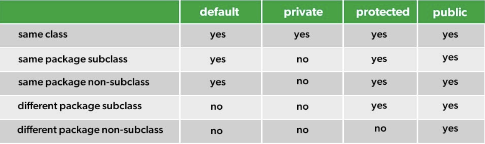

# JAVA
---
## JAVA Types

---

## Key terms
### Deterministic
>$f(x)$ always return the same value for the same value $x$.

### Embarrassingly Parallel
>In parallel programming, an embarrassingly parallel algorithm is one that requires no communication or dependency between the processes.

---
## Java API
### Java Util
| CS2030S                                  | java.util.function     |
| ---------------------------------------- | ---------------------- |
| `Immutator<Boolean,T>::invoke`           | `Predicate<T>::test`   |
| `Producer<T>::get` / `Constant<T>::init` | `Supplier<T>::get`     |
| `Immutator<R,T>::invoke`                 | `Function<T,R>::apply` |
| `Immutator<T,T>::invoke`                 | `   UnaryOp<T>::apply`

### Java Container
| CS2030S           | java.util.function           |
| ----------------- | ---------------------------- |
| `Probably<T>`     | `java.util.Optional<T>`      |
| `Actuallt<T>`     | `NA`                         |
| `Lazy<T>`         | `N/A`                        |
| `InfiniteList<T>` | `java.util.stream.Stream<T>` | 

---
## Tips

### Jshell
- Create and use `.jsh` file to open file together: `/open <name>.jsh`

