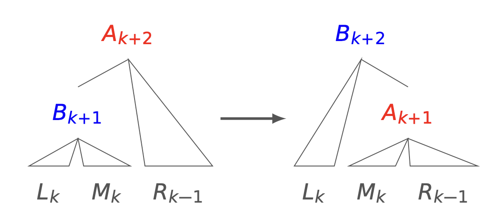
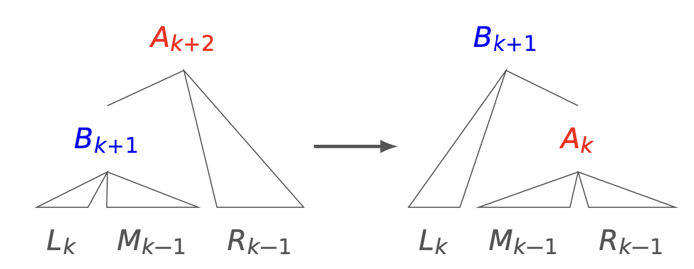
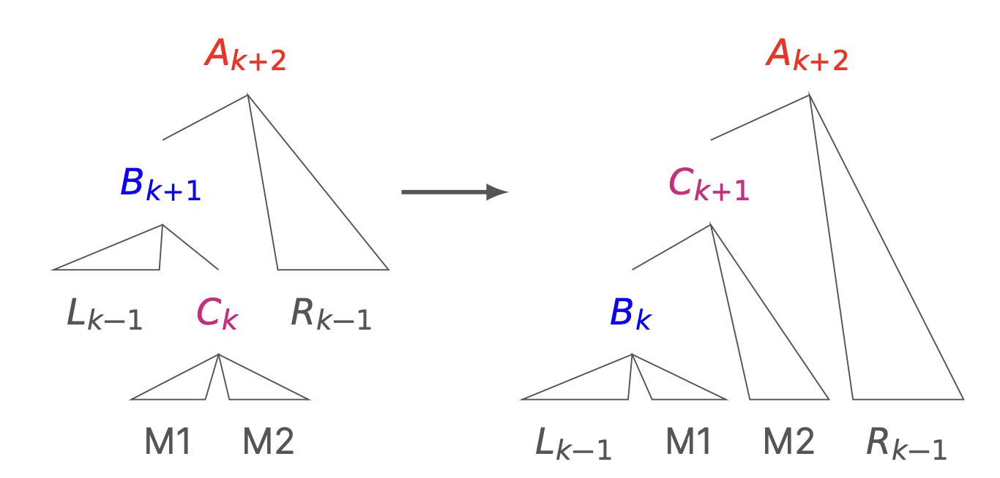
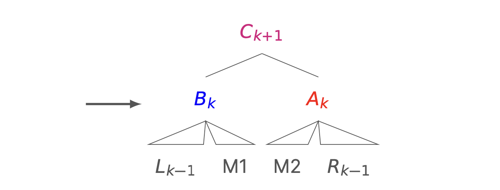
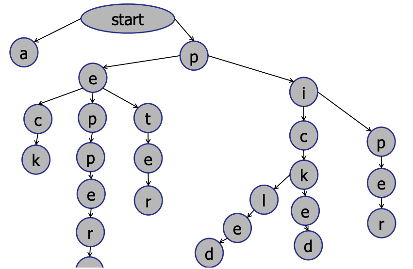

# Trees

> [!Abstract]- Resources
> [CS2040_08.Trees](../Notes/CS2040_08.Trees.pdf)
> 
> [CS2040_09.BalancedTrees](../Notes/CS2040_09.BalancedTrees.pdf)
> 
> [CS2040_10.MoreTrees](../Notes/CS2040_10.MoreTrees.pdf)
> 
> [CS2040_11.AugmentedTrees](../Notes/CS2040_11.AugmentedTrees.pdf)
> 
> [CS2040_12.TreesandHeaps](../Notes/CS2040_12.TreesandHeaps.pdf)

## Binary Search Trees

The **binary search tree property** states that all keys in the left sub-tree are less than the parent key, and all keys in the right subtree are greater than the parent key.

The **height** of a BST is the number of edges on the longest path from the root to the leaf:

The **minimum** and **maximum** keys are found by traversing the left and right subtrees respectively.

**Inserting** is akin to searching, but instead adding a new node at a leaf.

**Deleting** is trivial if if the node to be deleted has one or no children. Otherwise, the node to be deleted is replaced by the minimum of the right subtree (its successor).

All these operations are O(h). If balanced this will be $O(\log n)$.

### Traversal

**In-order:** Visit left subtree $\to$ self $\to$ right subtree
**Pre-order:** Visit self $\to$ left subtree $\to$ right subtree
**Post-order:** Visit left subtree $\to$ right subtree $\to$ self

## AVL Tree

Augmented BST which <u>stores the tree height</u>  in each node. This augmented height must be updated with every insert and deleted.

A binary search tree is **balanced** iff $h=O(\log n)$, such that all operations take $O(\log n)$ time.

A node $v$ is **height-balanced** iff $\mid v$. left. height - v.right. height $\mid \leq 1$. A height-balanced tree with $n$ nodes has height $h<2 \log n$, and one with height $h$ has at least $n>2^{\frac{h}{2}}$ nodes.

**balancing:** Perform in-order traversal on BST ($O(n)$) . Construct an AVL tree in $O(n)$ time by picking the middle element as the root recursively do the same for sublists.

### Rotations

Case 1: $A$ is left-heavy but $B$ is balanced $\rightarrow$ right-rotate.

Case 2: $A$ is left-heavy but $B$ is left-heavy $\rightarrow$ right-rotate.

Case $3: A$ is left-heavy but $B$ is right-heavy $\rightarrow$ left-rotate $B$ $\to$ right-rotate about $A$.

After an insert, at most 2 rotations are needed, but delete may require up to O(log n) rotations. This is because delete reduces height and rotations reduce height, so it is not sufficient to only fix the lowest imbalanced node in the tree.

- Delete key from BST.
- Walk up tree:
- At every step, check for balance.
- If out-of-balance, use rotations to rebalance.
- Continue to root.

## Trie

End of the word can be marked with a wildcards.