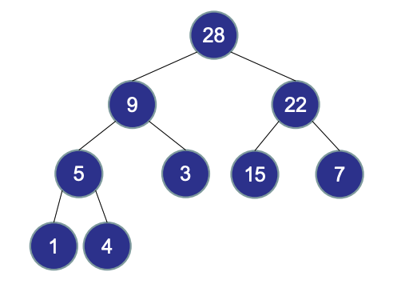
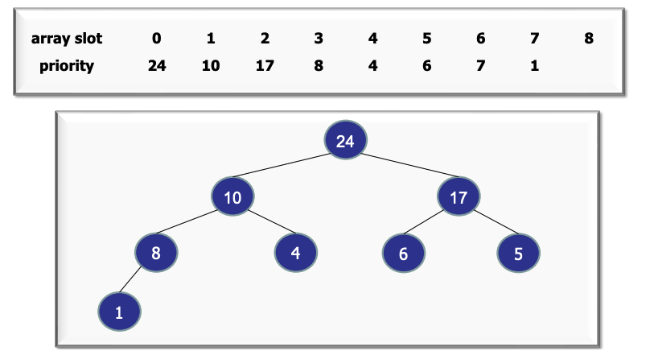

# Heaps

> [!abstract]- Resources
> [PDF](CS2040_12.TreesandHeaps.pdf#page=112)
## Basics

A binary heap is a heap data structure that takes the form of a binary tree. Two properties holds for a binary heap:

1. $\text { priority[parent] >= priority[child] }$
2. Complete binary tree 
	1. Every level is full, except possibly the last
	2. All nodes are as far left as possible

## Heap Operations

**Insert:** Adds the node to the end of the tree (as far left as possible). To put the node in the correct position, bubble up (swap with parent) if the node is greater than the parent. $O(\log n)$. [Example](CS2040_12.TreesandHeaps.pdf#page=124).

**Increase key:** Update the priority. Bubble up. $O(\log n)$.  [Example](CS2040_12.TreesandHeaps.pdf#page=137).

**Decrease Key:** Update the priority. Bubble down to the LEFT. $O(\log n)$.  [Example](CS2040_12.TreesandHeaps.pdf#page=140).

**Delete:** Swap the node with the last node. Bubble down the swapped node to the correct location.  $O(\log n)$. [Example](CS2040_12.TreesandHeaps.pdf#page=150).

**Extract Max:** Perform the Delete operation on the root. $O(\log n)$. [Example](CS2040_12.TreesandHeaps.pdf#page=156).
## Store Tree in an Array

Binary heap can be implemented with an implicit data structure without pointers, using a **heap array**. Building  the array can be done in $O(n)$ time. Visit [PDF](CS2040_12.TreesandHeaps.pdf#page=160).

To **access a children** of node $i$, we use index arithmetic: 

- Left child index: $2i+1$
- Right child index: $2i+2$

To **access the parent**: $\frac{{i-1}}{2}$.

**Building a Heap from a unsorted list**: Start at the end of the array. For all items, perform a bubble down operation. Cost = $O(n)$. [Example](CS2040_12.TreesandHeaps.pdf#page=210).

**To obtain a sorted list from a heap array:** Perform a extract max operation for $n$ items. Cost: $O(n\log n)$. [Example](CS2040_12.TreesandHeaps.pdf#page=179).

## Summary

- $O(n \log n)$ time worst-case
- In-place: only need n space.
- Fast:
	- Faster than MergeSort
	- A little slower than QuickSort.
- Deterministic: always completes in $\mathrm{O}(n \log n)$
- Unstable (Come up with an example!)
- Ternary (3-way) HeapSort is a little faster.