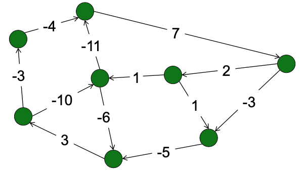
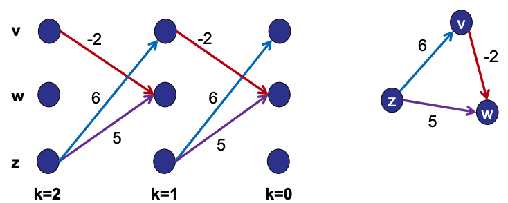
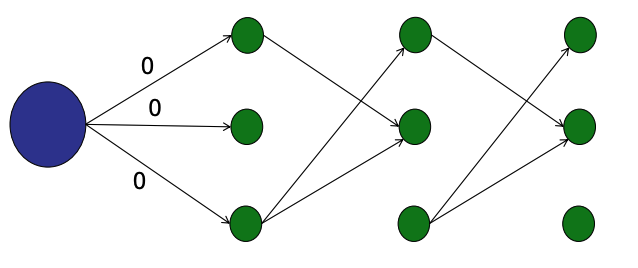
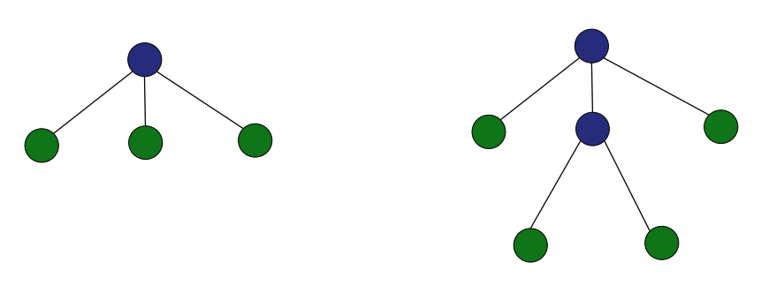
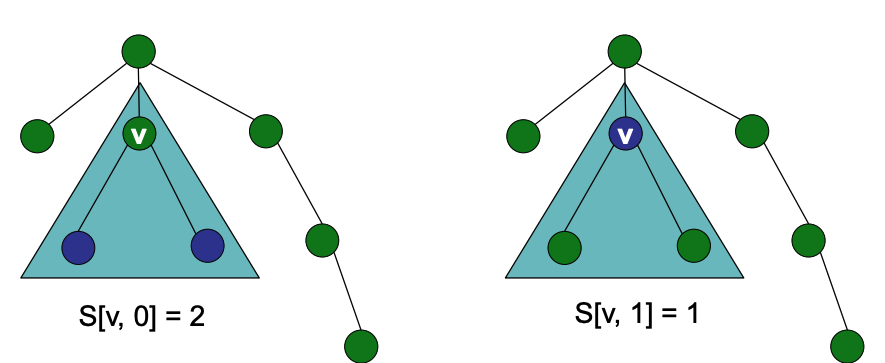
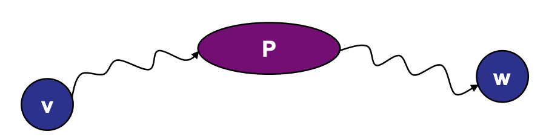
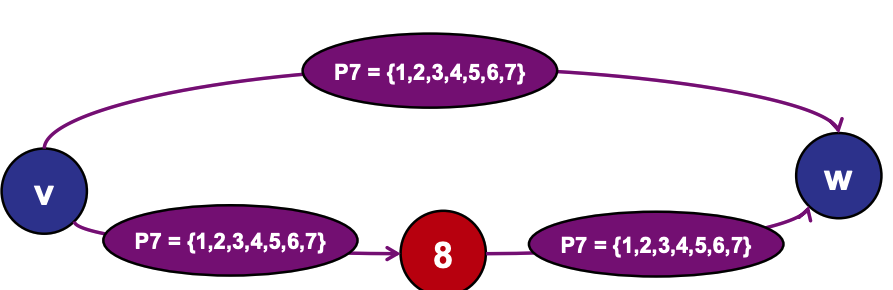

# Dynamic Programming

> [!info]- Resources
> [Video](https://youtu.be/xSHOtb_RAJE) - [CS2040_22.DynamicProgrammingIntro](../Notes/CS2040_22.DynamicProgrammingIntro.pdf)  
> 
> [video](https://youtu.be/KITJ2jmRRXM) - [CS2040_23.DynamicProgramming2](../Notes/CS2040_23.DynamicProgramming2.pdf) 

## Basics

Dynamic programming is just a fancy name for:

- Breaking up a problem into smaller sub-problems
- Optimal solution to sub-problems should be components of the optimal solution to the original problem
- Build the optimal solution iteratively by filling in a table of sub-solutions
- Take advantage of overlapping sub-problems

**Overlapping sub-problems:** The same smaller problem is used to solve multiple different bigger problems.

### Basic Strategy: Bottom up dynamic programming

### Basic Strategy: Top down dynamic programming

These are just brief concepts. We will understand them with various examples in the upcoming sections.

- [Longest Increasing Subsequence](#Longest%20Increasing%20Subsequence)
- [Bounded Prize Collecting](#Bounded%20Prize%20Collecting)
- [Vertex Cover on a Tree](#Vertex%20Cover%20on%20a%20Tree)
- [All-Pairs Shortest Paths](#All-Pairs%20Shortest%20Paths)

## Longest Increasing Subsequence

**Problem:**. You are give an sequence of integers. Your goal is to find the increasing subsequence of maximum length.

{8,3,6,4,5,7,7} 

### DAG Solution

One way to find such maximum length is with [Directed Acyclic Graphs](17.Graphs.md#Directed%20Acyclic%20Graphs). For each nodes, draw a directed array to any other nodes with greater value.

**STEP 1:** Topological sort
**STEP 2:**  Calculate longest path - DAG_SSSP. LIS = max(LP)+1
**Performance:** Longest path takes $O(V+E)=O(n^2)$ , Run longest path $n$ times $O(n^3)$

This is inefficient. We don't have to run it n times because to find the maximum path for a node, the maximum path for other connected node have to be solved. This is a example of a overlapping subproblems.

### Using a bottom up approach

Start with the smallest sub-problem:

Move to the next node and examine all outgoing edges and find the maximum. Its largest path will be 1 +  the maximum of the outgoing edge:

Continue for all nodes:

Performance: $O(n^2)$

### Dynamic Programming Recipe

In summary the dynamic programming recipe consist of the following steps:

- **Step 1:** Identify optimal substructure
	- E.g, LIS can be built from suffix LIS
- **Step 2:** Define sub-problems
	- E.g., $S[i]=\operatorname{LIS}(A[i . . n])$ starting at $A[i]$
- **Step 3:** Solve problem using sub-problems
	- E.g., $S[i]=\left(\max _{(i, j) \in E} S[j]\right)+1$
- **Step 4:** Write (pseudo)code
	- E.g. [Code](CS2040_22.DynamicProgrammingIntro.pdf#page=46%7CCode)
## Bounded Prize Collecting

**Problem:**. You are given a Directed Graph `G=(V,E)` and edges weights `w` which represents the prizes on each edges. Your goal is to find a path that maximizes the total collected by crossing at most `k` edges. 

### Idea 1:

- Transform G into a DAG
- Make k copies of every note. For a simple case for 3 node, it may look like:
- Solve prize collecting via DAG_SSSP (longest path)
- Running time = $O(kVE)$ See [PDF](../Notes/CS2040_23.DynamicProgramming2.pdf#page=27).

To reduce the running time, instead of starting the SSSP algorithm for each node separately, you can create a super source node where edges are all 0. This gives a running time of `O(KE)`

### Idea 2:

- If you know the optimal solution for `(k-1`, then it is easy to compute the optimal solution for `k`
- Define `P[v, k]` = maximum prize that you can collect starting at v and taking exactly k steps.
- Solve `P[v,k]` using subproblems:

$$
\begin{aligned}
& P[v, k]=\operatorname{MAX}\left\{\quad P\left[w_1, k-1\right]+w\left(v, w_1\right),\right. \\
& P\left[w_2, k-1\right]+w\left(v, w_2\right), \\
& \left.P\left[w_3, k-1\right]+w\left(v, w_3\right), \ldots\right\} \\
&
\end{aligned}
$$

Visit [PDF](../Notes/CS2040_23.DynamicProgramming2.pdf#page=35) for example. The cost is $O(kE)$. See [PDF](../Notes/CS2040_23.DynamicProgramming2.pdf#page=40) 

## Vertex Cover on a Tree

**Problem:**. You are given a undirected, unweighted tree `G=(V,E)`. Your goal is to find the size of a smallest set of nodes `C` where every edge is adjacent to at least one node in `C`

Notation: 

- `S[V,0]` = size of vertex cover in subtree rooted at node v if v is NOT covered.
- `S[V,1]` = size of vertex cover in subtree rooted at node v, if v IS covered.

Given these notations, the <u>base case</u> is starting at the leaves: 

- `S[leaf,0]` = 0
- `S[leaf,1]` = 1

Then,

- $S[v, 0]=S\left[w_1, 1\right]+S\left[w_2, 1\right]+S\left[w_3, 1\right]+\ldots$ where $w$ are the children of $v$. This is because if $v$ is not in the vertex cover, then we need to cover all of $v$'s children.
-  $S[v, 1]=1+\mathrm{W}_1+\mathrm{W}_2+\mathrm{W}_3+\ldots$
	- where $\mathrm{W}_1=\min \left(S\left[\mathrm{w}_1, 0\right], S\left[\mathrm{w}_1, 1\right]\right)$ ...
- See [code](../Notes/CS2040_23.DynamicProgramming2.pdf#page=57) 

**Running time:** 

- 2V sub-problems
- `O(V)` time to solve all subproblems
	- Each edge explored once.
	- Each sub-problem involves exploring children edges.
## All-Pairs Shortest Paths

**Problem**: You are given a directed, weighted graph `G=(V,E)`. Your goal is to preprocess G to prepare for the query min-distance(v,w) 

**Solution:** On preprocessing: Use Dijkstra algorithm for a node and store the weight for each nodes. Repeat for every other node

## Floyd-Warshall

Let $S[v,w,P]$ be the shortest path from $v$ to $w$ that only uses intermediate nodes in the set $P$.

**Solution:** $S[v,w,P_{n+1}] =\text{min}(S[v,w,P_{n}],S[v,n+1,P_{n}]+S[n+1,w,P_{n}])$. Where $n$ is the nth node in $P$. For example, if you want to find $S[v,w,P_{8}]$, the possible path of going to $w$ will look like this:

