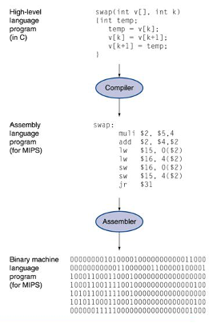

# Introduction

## Programming Languages

**Programming language:** a formal language that specifies a set of instructions for a computer to implement specific algorithms to solve problems.

## Abstraction

**High-level program**

- Level of abstraction closer to problem domain

- Provides productivity and portability, Easy to read

**Low-level program**

- Textual and symbolic representation of instructions

**Machine Code**

- Binary bits of instructions and data

### Abstraction layers

## So, What is a Computer ?

A computer is a device capable of solving problems according to designed programs. It simply augments our power of storage and speed of calculation.

From computer organisation perspective, we study the components and how they work together. Processor, memory, io devices, networks...

### Components of a computer

- Power supply
- Motherboard
- Central Processing Unit (CPU)
- Random Access memory (RAM)
- Hard drive 
- Cooling fan
- I/O Devices

## Why study Computer Organisation ?

- Computer organisation is the study of internal working, structuring and implementation of a computer system.
- It refers to the level of abstraction above the digital logic level, but below the operating system level.

### From User to Builder

- You want to call yourself a computer scientist/specialist.
- You want to build software people use.
- You need to make purchasing decisions.
- You need to offer “expert” advice.
- Hardware and software affect performance
- Algorithm determines number of source-level statements  
  (eg: CS1010, CS2030, CS2040, CS3230)
- Language, compiler, and architecture determine machine instructions 
  (COD chapters 2 and 3)
- Processor and memory determine how fast instructions are executed 
  (COD chapters 5, 6 and 7)
- Understanding performance (COD chapter 4)

