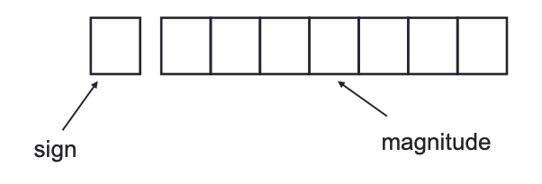
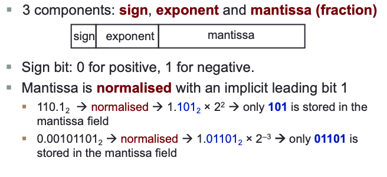
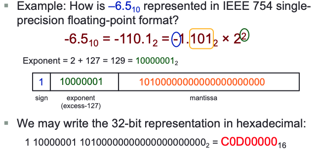

# Number Systems

## Data Representation

### Basic data types in C:

Data is represented depending on its type. This is why C requires to declare datatype. 

### Unit

- _Byte_: 8 bits
- Nibble: 4 bits (rarely used now)
- _Word_: Eg in 7694, the digit 7 has the weight of 1000.
- _$N$_ bits can represent up to _ $2^N$_ values
- To represent $M$ values, _$\left\lceil\log _2 M\right\rceil$_ bits required

### Number System

- _Binary_ (base 2)
	- Weights in powers of 2
	- Binary digits (bits): $\mathbf{0 , 1}$
- _Octal_ (base 8)
	- Weights in powers of 8
	- Octal digits: $\mathbf{0 , 1}, \mathbf{2 , 3}, \mathbf{4 , 5 , 6 , 7 .}$
- _Hexadecimal_ (base 16)
	- Weights in powers of 16
- Base/radix $R$ :
	- Weights in powers of $R$

## Number representation of certain bases in Programming languages 

In programming language C

- Prefix _0_ for octal. Eg: 032 represents the octal number $(32)_8$
- Prefix _0x_ for hexadecimal. Eg: 0x32 represents the hexadecimal number $(32)_{16}$

In QTSpim (a MIPS simulator you will use)

- Prefix _0x_ for hexadecimal. Eg: 0x100 represents the hexadecimal number $(100)_{16}$

In Verilog, the following values are the same

- _8'b_ 11110000: an 8-bit binary value 11110000
- _8'h_ F0: an 8-bit binary value represented in hexadecimal F0
- _8'd_ 240: an 8-bit binary value represented in decimal 240

## Decimal to Binary Conversion

### Repeated Division-by-2

To Convert a _whole number_ to binary:
$(43)_{10}=(101011)_2$

 

### Repeated Multiplication-by-2

To convert _decimal fractions_ to binary:
$(0.3125)_{10}=(.0101)_2$ 

## Conversion between decimal and other Bases

- _Base- $R$ to decimal_: multiply digits with their corresponding weights
- _Decimal to binary (base 2)_
	- Whole numbers: repeated division-by-2
	- Fractions: repeated multiplication-by-2
- _Decimal to base- $R$_
	- Whole numbers: repeated division-by- $R$
	- Fractions: repeated multiplication-by- $R$

## Conversion Between Bases

## ASCII Code

-  American Standard Code for Information Interchange
-  7 bits, plus 1 parity bit (odd or even parity

Note: If you want to convert ASCII number to binary number, subtract ASCII 0 from ASCII number. Eg. ASCII 9 to binary 9 is: 0111001-0110000 = 1001

## Negative Numbers

- _Unsigned numbers_: Only non-negative values
- _Signed numbers_: include all values (positive and negative)

There are 3 common representations for signed binary numbers

### Sign-and-Magnitude 

- The sign is represented by a ‘_sign bit_’ 
	- 0 for +
	- 1 for -
	- eg $00100001_{sm}$ (sm is used to indicate sign-and-magnitude)

- Largest value: 01111111 = $+127_{10}$
- Smallest value: 11111111 = $-127_{10}$
- Zeros: 00000000 = $+0_{10}$, 100000000 = $-0_{10}$
- Range (for 8-bit): $-127_{10}$ to +$127_{10}$

This is method is not good for arithmetic

### 1s Complement 

Given a binary $x$. its negated value can be obtained in 1s-complement by inverting the bits.

- Largest value: $\quad 01111111=+127_{10}$
- Smallest value: $\quad 10000000=-127_{10}$
- Zeros: $\quad 00000000=+0_{10}$ $11111111=-0_{10}$
- Range (for 8 bits): $-127_{10}$ to $+127_{10}$
- Range (for $n$ bits): $-\left(2^{n-1}-1\right)$ to $2^{n-1}-1$
- The most significant bit (MSB) still represents the sign: 0 for positive, 1 for negative.

### 2s Complement

Given a binary $x$, its negated value can be obtained in 2s-complement representation using:

$$-x=2^n-x$$
Or, invert the bits and add 1.

### Complement on Fractions

We can extend the idea of complement on fractions.

- Negate $0101.01$ in 1s-complement
  Answer: $1010.10$
- Negate $0101.01$ in 2s-complement
  Answer: $1010.11$

### 2s Complement on Addition/Subtraction

Algorithm for addition of integers, $A+B$ :

1. Perform binary addition on the two numbers.
2. Ignore the carry out of the MSB.
3. Check for overflow. Overflow occurs if the 'carry in' and 'carry out' of the MSB are different, or if result is opposite sign of $A$ and $B$.

Algorithm for subtraction of integers, $A-B=A+(-B)$

1. Take 2s-complement of  B.
2. Add the 2 s-complement of $B$ to $A$.

#### Overflow

Example: 4-bit 2s-complement system

- Range of value: $-8_{10}$ to $7_{10}$
- $0101_{2 \mathrm{~s}}+0110_{2 \mathrm{~s}}=1011_{2 \mathrm{~s}}$ $5_{10}+6_{10}=-5_{10}$ ?! (overflow!)
- $1001_{2 \mathrm{~s}}+1101_{2 \mathrm{~s}}=10110_{2 \mathrm{~s}}$ (discard end-carry) $=0110_{2 \mathrm{~s}}$ $-7_{10}+-3_{10}=6_{10}$ ?! (overflow!)

### 1s Complement on Addition/Subtraction

Algorithm for addition of integers, $A+B$ :

1. Perform binary addition on the two numbers.
2. If there is a carry out of the MSB, add 1 to the result.
3. Check for overflow. Overflow occurs if result is opposite sign of $A$ and $B$.

Algorithm for subtraction of integers, $A-B=A+(-B)$

1. Take 1s-complement of $B$.
2. Add the $1 \mathrm{~s}$-complement of $\mathrm{B}$ to $\mathrm{A}$.

### Excess Representation

## Real Numbers

Due to the finite number of bits, real number are often represented in their approximate values.
### Fixed Point Representation

Eg $011010.11_{2 \mathrm{~s}}=26.75_{10}$

### Floating-Point Representation

Allow to represent very large or very small numbers

Examples:

- $0.23 \times 10^{23}$ (very large positive number)
- $0.5 \times 10^{-37}$ (very small positive number)
- $-0.2397 \times 10^{-18}$ (very small negative number)

#### IEEE 754 Floating-Point Rep

